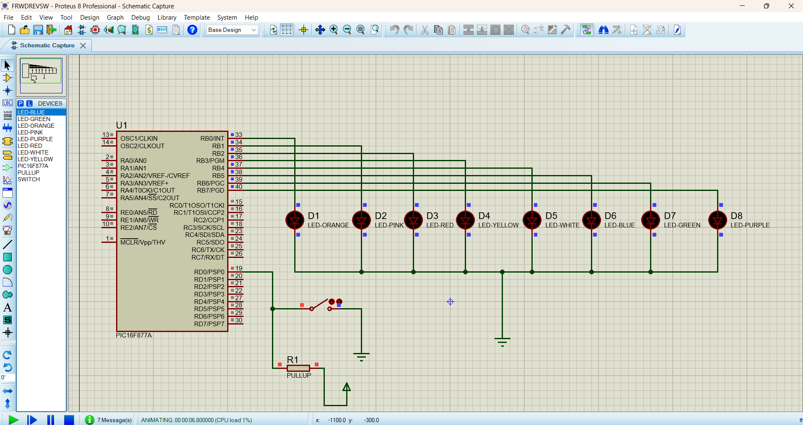

# Forward & Reverse LED Control Using One Switch

This project demonstrates **Forward and Reverse LED control using the PIC16F877A microcontroller and a single switch**. Eight LEDs connected to PORTB are controlled based on the switch condition.

## Components Used

* PIC16F877A Microcontroller
* 8 LEDs
* 1 Push Button / Switch
* Proteus 8
* MPLAB IDE

## Software Used

* MPLAB IDE
* Proteus 8 Professional

## Files

* `forward_reverse.c` → Embedded C source code
* `forward_reverse.png` → Proteus circuit
* `forward_reverse_output.png` → Output screenshot

## Working

The program continuously checks the switch connected to **RD0**.

* **Switch ON** → Forward and Reverse LED sequence starts.
* **Switch OFF** → All LEDs are turned OFF immediately.

The LEDs first turn ON from **LED1 to LED8** and then turn back from **LED7 to LED2**, creating a continuous Forward and Reverse effect.

### LED Sequence

**LED1 → LED2 → LED3 → LED4 → LED5 → LED6 → LED7 → LED8**

**LED7 → LED6 → LED5 → LED4 → LED3 → LED2**

The sequence repeats continuously while the switch remains ON.

## Pin Configuration

| PIC16F877A Pin | Function |
| -------------- | -------- |
| RB0            | LED1     |
| RB1            | LED2     |
| RB2            | LED3     |
| RB3            | LED4     |
| RB4            | LED5     |
| RB5            | LED6     |
| RB6            | LED7     |
| RB7            | LED8     |
| RD0            | Switch   |

This project helps to understand **switch interfacing, GPIO input/output control, LED interfacing, bit shifting, time delay, and Forward/Reverse LED sequencing using Embedded C and the PIC16F877A microcontroller.**

## Circuit Image

## Output Image 
