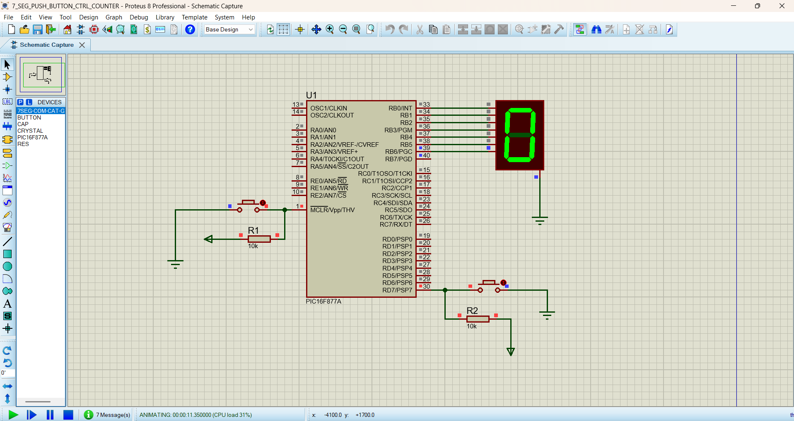

# 7-Segment Press Counting Using PIC16F877A

This project demonstrates **press counting using a 7-segment display and PIC16F877A microcontroller**. Each time the push button is pressed, the counter increments from **0 to 9** and then returns to **0**.

## Components Used

* PIC16F877A Microcontroller
* 7-Segment Display
* Push Button / Switch
* Resistors
* 20 MHz Crystal
* Proteus 8
* MPLAB IDE

## Software Used

* MPLAB IDE
* MPLAB XC8 Compiler
* Proteus 8 Professional

## Working

The 7-segment display is connected to **PORTB**, and the push button is connected to **RD7**.

* **Button Pressed** → Counter increases by 1
* **Each Press** → Display changes to the next number
* **0 to 9** → Counter sequence
* **After 9** → Counter returns to 0

A small debounce delay is used to prevent a single button press from being counted multiple times.

## Pin Configuration

| PIC16F877A Pin | Function          |
| -------------- | ----------------- |
| RB0–RB7        | 7-Segment Display |
| RD7            | Push Button       |

## Counting Sequence

```text
0 → 1 → 2 → 3 → 4 → 5 → 6 → 7 → 8 → 9 → 0
```

## Project Flow

```text
Push Button
     ↓
PIC16F877A
     ↓
Counter
     ↓
7-Segment Display
     ↓
0 to 9
```

## Applications

* Digital counters
* Object counting
* Push-button counters
* Embedded display systems
* Industrial counting systems

## Learning Outcome

This project helps to understand **7-segment interfacing, switch interfacing, button debouncing, counter programming, GPIO control, and Embedded C programming using the PIC16F877A**.

## CIRCUIT IMAGE


## OUTPUT VIDEO
<video controls src="output_seg.mp4" title="output"></video>