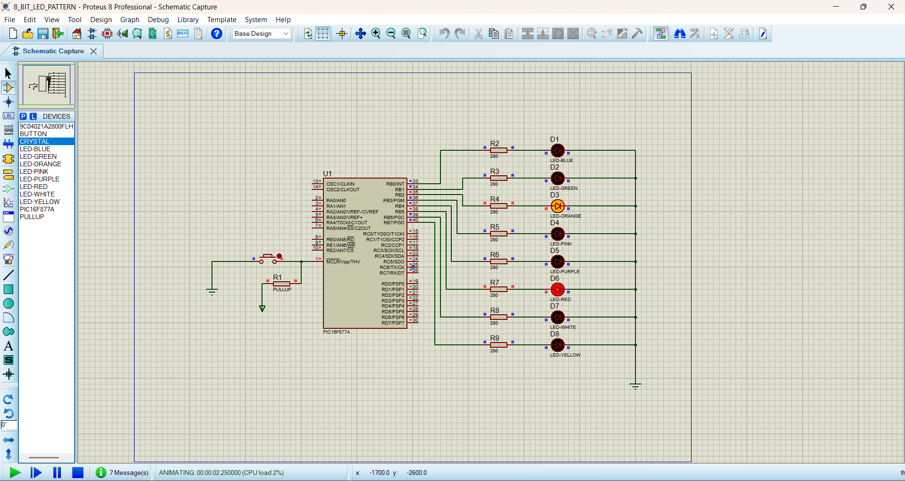
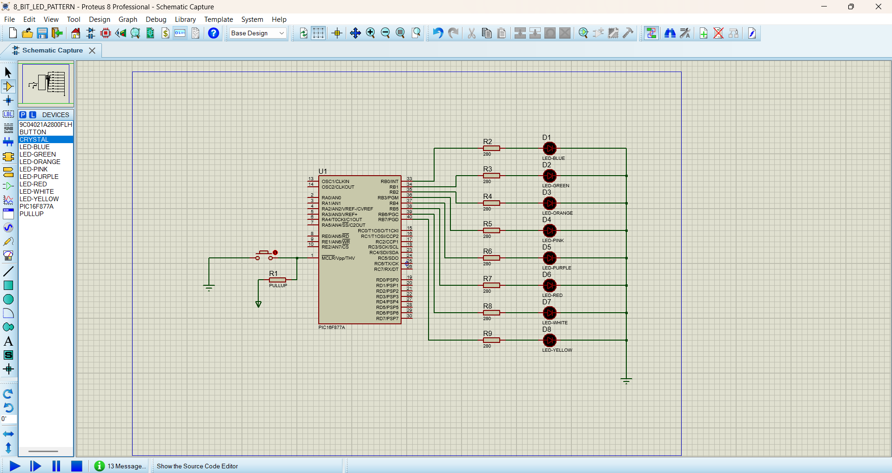

# LED Pattern Generation Using PIC16F877A

This project demonstrates **LED pattern generation using the PIC16F877A microcontroller**. Eight LEDs connected to PORTB are controlled to produce different LED patterns with a fixed time delay.

## Components Used

* PIC16F877A Microcontroller
* 8 LEDs
* 8 × 220Ω Resistors
* 20 MHz Crystal
* 2 × 22pF Capacitors
* Proteus 8
* MPLAB IDE

## Software Used

* MPLAB IDE
* Proteus 8 Professional
* MPLAB XC8 Compiler

## Files

* `led_pattern.c` → Embedded C source code
* `led_pattern.png` → Proteus circuit
* `led_pattern_output.png` → Output screenshot

## Working

The program configures **PORTB as an output** and continuously generates four different LED patterns.

Each pattern is displayed for **100 ms** before changing to the next pattern.

The sequence repeats continuously.

### LED Pattern Sequence

**`0x18` → `0x24` → `0x42` → `0x81`**

### Binary Pattern

**`00011000`**

↓

**`00100100`**

↓

**`01000010`**

↓

**`10000001`**

↓

**Repeat**

The pattern creates a visual LED movement effect from the center LEDs toward the outer LEDs.

## Pin Configuration

| PIC16F877A Pin | Function |
| -------------- | -------- |
| RB0            | LED1     |
| RB1            | LED2     |
| RB2            | LED3     |
| RB3            | LED4     |
| RB4            | LED5     |
| RB5            | LED6     |
| RB6            | LED7     |
| RB7            | LED8     |

## Pattern Details

| Hex Value | Binary Value | LEDs ON    |
| --------- | ------------ | ---------- |
| `0x18`    | `00011000`   | LED4, LED5 |
| `0x24`    | `00100100`   | LED3, LED6 |
| `0x42`    | `01000010`   | LED2, LED7 |
| `0x81`    | `10000001`   | LED1, LED8 |

## Timing

Each LED pattern is displayed for:

**100 ms**

One complete sequence takes approximately:

**400 ms**

## Learning Objectives

This project helps to understand **PORTB configuration, GPIO output control, LED interfacing, binary and hexadecimal values, bit patterns, software delay, and sequential LED pattern generation using Embedded C and the PIC16F877A microcontroller.**

## CIRCUIT IMAGE

## OUTPUT IMAGE
